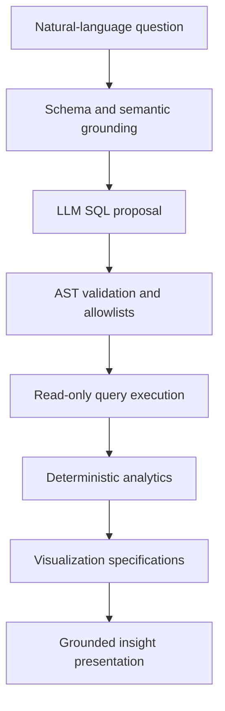

# Architecture

## Design principle

AI SQL Data Analyst separates probabilistic language generation from
deterministic validation, execution, calculation, and presentation:

> The LLM proposes. Software validates. The database restricts. Code
> calculates. AI explains.

## Request flow

The public presentation boundary is
`POST /api/v1/presentations/generate`. It accepts a question. It does not
accept SQL supplied by the client.

## Components

### FastAPI backend

The backend exposes health, readiness, schema, grounding, SQL generation,
execution, analytics, visualization, insight, and presentation contracts.
The OpenAPI document contains these paths:

- `GET /health`
- `GET /ready`
- `GET /api/v1/schema/catalog`
- `POST /api/v1/grounding/context`
- `POST /api/v1/sql/generate`
- `POST /api/v1/query/execute`
- `POST /api/v1/analytics/analyze`
- `POST /api/v1/visualizations/specify`
- `POST /api/v1/insights/generate`
- `POST /api/v1/presentations/generate`

### Streamlit frontend

The frontend submits natural-language questions to the backend and renders
validated SQL, tabular results, KPI specifications, Plotly charts, and
grounded claims. It does not execute SQL directly.

### Schema intelligence and semantic layer

Schema intelligence exposes approved tables, columns, keys, relationships,
indexes, and comments. The semantic layer maps business vocabulary to
deterministic metric and dimension definitions.

### LLM provider boundary

Provider implementations generate structured proposals. Their output is
parsed into Pydantic contracts before further processing. Provider
lifecycle is owned by the application lifespan and credentials remain
runtime-only configuration.

### SQL validation and execution

SQL is parsed before execution. Only supported read-only statements pass.
Validation rejects unsupported statements, unknown identifiers, multiple
statements, and unsafe constructs. Execution uses a read-only PostgreSQL
role, statement timeout, row limits, and explicit transaction controls.

### Analytics and visualization

Analytics are calculated by application code from query results.
Visualization selection produces deterministic KPI, table, bar, and line
specifications. Tables are limited to 100 rows, bars to 20 categories, and
lines to 200 points. The LLM does not calculate authoritative metrics and
does not directly construct executable charts.

### Grounded insights

Insight generation receives validated analytical evidence. Claims must
reference supported evidence identifiers, while unsupported or malformed
proposals are rejected.

## Container topology

Docker Compose defines exactly three services:

- `postgres`, with persistent storage and a health check;
- `backend`, built from `Dockerfile.backend` after PostgreSQL is healthy;
- `frontend`, built from `Dockerfile.frontend` after the backend is
  healthy.

Backend and frontend run as UID `10001`, do not mount host source
directories, and publish ports on loopback.

## Trust boundaries

1. User input is untrusted.
2. LLM output is untrusted.
3. Generated SQL is untrusted until deterministic validation succeeds.
4. The database independently restricts the application role.
5. Returned rows are bounded before analytics and rendering.
6. Insight claims require evidence produced by validated code paths.

## CI architecture

GitHub Actions contains two least-privilege jobs:

- `quality`: Python 3.12 and 3.13, installation, Ruff, mypy, and pytest;
- `container`: Compose validation, backend and frontend builds, and
  networkless non-root smoke tests.

The workflow references no repository secrets and publishes no images.
